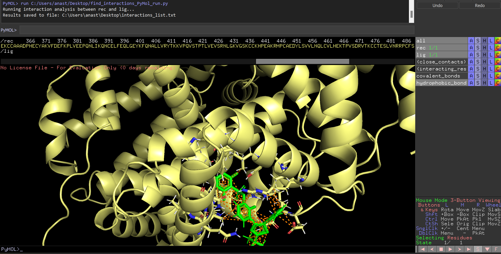

# find_interactions_PyMol_run.py

## Description

The `find_interactions_PyMol_run.py` script is designed to analyze molecular interactions between a receptor and a ligand within a structure loaded in PyMOL. It automatically identifies and classifies various types of interactions, such as hydrogen bonds, hydrophobic interactions, salt bridges, van der Waals interactions, and others.

This script is useful for post-docking analysis in molecular modeling, enabling quick identification and visualization of key interactions between molecules.

## Features

- **Hydrophobic Interactions:** Identified by the presence of carbon and sulfur atoms within a 4 Å distance.
- **Hydrogen Bonds:** Consider donors and acceptors of hydrogen bonds (N, O, F) within a 3.5 Å distance.
- **Salt Bridges:** Interactions between positively and negatively charged atoms within a 4 Å distance.
- **Van der Waals Interactions:** Determined based on distance (1.6-4.0 Å) if not classified as hydrophobic or hydrogen bonds.
- **Aromatic and Cation-π Interactions:** Analyzed based on specific atoms and distances.
- **Visualization:** Automatically displays interacting residues and draws bonds between them in PyMOL.

 Usage

1. Save the `find_interactions_PyMol_run.py` script in the desired directory.
2. Open PyMOL and load your receptor-ligand complex structure.

### Important: Ensuring `rec` and `lig` are Separate Objects

- **Separate Objects Requirement:** The receptor (`rec`) and ligand (`lig`) must be loaded as separate objects in PyMOL. This is necessary for the script to correctly identify and analyze the interactions between them.

- **Alternatively:** You can change the object names in the script to match your current object names. If you are working with ClusPro models, there is no need to make any changes to the script.

3. Run the script in the PyMOL command line:
   ```python
   run C:/path/to/find_interactions_PyMol_run.py
    ```

## Output
The analysis results are saved in a text file named `interactions_list.txt`, which contains information about the types of interactions, the atoms involved, and the distances between them. Each interaction is classified by type, and the atoms are represented in PyMOL format (chain/residue/atom).



Example file content:

```
HYDROPHOBIC INTERACTIONS:
A/LEU`387/CD1 -- A/DST`965/C12 : 3.88 Å
A/LEU`387/CD1 -- A/DST`965/C13 : 3.79 Å
A/LEU`387/CD1 -- A/DST`965/C14 : 3.54 Å
A/ASN`391/CG -- A/DST`965/C13 : 3.67 Å
A/ASN`391/CG -- A/DST`965/C14 : 4.00 Å
A/ASN`391/CG -- A/DST`965/C17 : 3.84 Å
...

SALT_BRIDGE INTERACTIONS:

COVALENT INTERACTIONS:

VDW INTERACTIONS:
A/LEU`387/CG -- A/DST`965/F2 : 3.18 Å
A/LEU`387/CD1 -- A/DST`965/F2 : 3.15 Å
A/LEU`387/CD1 -- A/DST`965/H12 : 3.66 Å
A/LEU`387/CD2 -- A/DST`965/F2 : 3.20 Å
...
```
